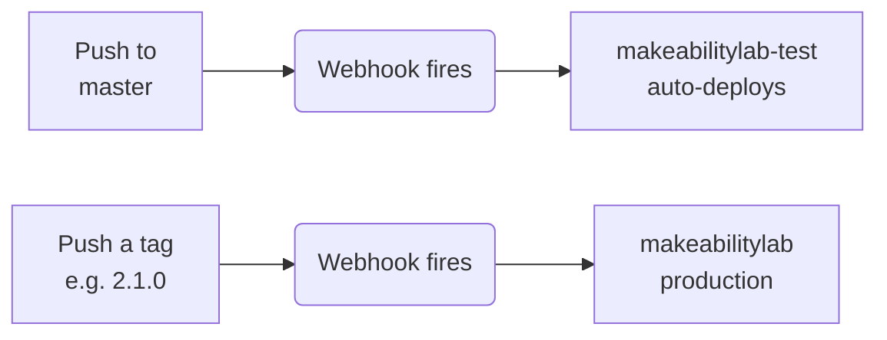

# Deployment Guide

This document covers the Makeability Lab website's production infrastructure, deployment pipeline, and server administration.

## Table of Contents

- [Deployment Guide](#deployment-guide)
  - [Table of Contents](#table-of-contents)
  - [Server Overview](#server-overview)
  - [Deployment Pipeline](#deployment-pipeline)
    - [Deploying to Test](#deploying-to-test)
    - [Deploying to Production](#deploying-to-production)
    - [Verifying Deployment](#verifying-deployment)
  - [Versioning](#versioning)
    - [Creating a Release](#creating-a-release)
  - [Server Configuration](#server-configuration)
    - [Configuration File](#configuration-file)
    - [Environment Variables](#environment-variables)
    - [Static Files vs. Dynamic Requests (Apache routing)](#static-files-vs-dynamic-requests-apache-routing)
    - [Search Engine Indexing (Sitemap & Google Search Console)](#search-engine-indexing-sitemap--google-search-console)
  - [Debugging \& Logging](#debugging--logging)
    - [Log Files](#log-files)
    - [Accessing Logs via Web](#accessing-logs-via-web)
    - [Accessing Logs via SSH](#accessing-logs-via-ssh)
    - [Windows Network Drive Access](#windows-network-drive-access)
  - [Data Management](#data-management)
    - [Uploaded Files](#uploaded-files)
    - [Database Access](#database-access)

## Server Overview

The Makeability Lab website runs on two UW CSE servers:

| Server | URL | Purpose |
|--------|-----|---------|
| **Test** | https://makeabilitylab-test.cs.washington.edu | Staging environment for testing changes |
| **Production** | https://makeabilitylab.cs.washington.edu | Live public-facing website |

Each server has its own:
- PostgreSQL database
- File storage backend
- Log files

> **Important:** Content added to the test server does **not** affect production, and vice versa. They are completely independent environments.

## Deployment Pipeline

Deployments are automated via GitHub webhooks:



### Deploying to Test

Any push to `master` automatically deploys to the test server:

```bash
git push origin master
```

### Deploying to Production

Production deployments require a version tag:

```bash
git tag 2.1.0
git push --tags
```

### Verifying Deployment

Check the build log to confirm deployment succeeded:

- **Test:** https://makeabilitylab-test.cs.washington.edu/logs/buildlog.txt
- **Production:** https://makeabilitylab.cs.washington.edu/logs/buildlog.txt

## Versioning

We use [Semantic Versioning](https://semver.org/) for production releases.

| Change Type | Version Component | Example |
|-------------|-------------------|---------|
| **First release** | Start at 1.0.0 | `1.0.0` |
| **Bug fixes**, minor patches | Increment PATCH (third digit) | `1.0.0` → `1.0.1` |
| **New features** (backward compatible) | Increment MINOR (second digit) | `1.0.1` → `1.1.0` |
| **Breaking changes** | Increment MAJOR (first digit) | `1.1.0` → `2.0.0` |

View current and past versions on the [Releases page](https://github.com/makeabilitylab/makeabilitylabwebsite/releases).

### Creating a Release

1. Ensure all changes are merged to `master` and tested on the test server
2. Confirm the Python test suite passes locally:

   ```bash
   docker exec makeabilitylabwebsite-website-1 python manage.py test website --settings=makeabilitylab.settings_test
   ```

   (See [Running the Test Suite](../CONTRIBUTING.md#running-the-test-suite) in `CONTRIBUTING.md` for what the suite covers and how to add to it.)

3. Determine the appropriate version number based on the changes
4. Create and push the tag:

   ```bash
   git tag 2.1.0
   git push --tags
   ```

5. Verify deployment via the [production build log](https://makeabilitylab.cs.washington.edu/logs/buildlog.txt)

## Server Configuration

The production server was configured by UW CSE's IT team (Jason Howe).

### Configuration File

Django reads database credentials and secret keys from `config.ini`. This file:
- Is **not** stored in Git (for security)
- Is mounted as a Docker volume on the production server
- Contains PostgreSQL connection strings and Django secret keys

### Environment Variables

Production-specific settings are configured in `settings.py` using values from `config.ini`. Local development uses different defaults specified in `docker-compose-local-dev.yml`.

### Static Files vs. Dynamic Requests (Apache routing)

On both servers, Apache sits in front of the Django container. It serves any URL that maps to a **real file** directly, and only **proxies to Django** (over plain HTTP) for paths that have no matching file. This has a few non-obvious consequences:

- **`/robots.txt` is a static file** — it is the top-level [`robots.txt`](../robots.txt) committed in the repo root, served by Apache from the project checkout. To change crawler rules or the advertised sitemap, edit that file and deploy. A Django view/route for `/robots.txt` would be dead code on the servers (it only runs under local `runserver`, which diverges from production).
- **`/sitemap.xml` is dynamic** — no such file exists, so Apache proxies it to Django's `django.contrib.sitemaps` (see `website/sitemaps.py`), which builds the XML from the database on each request.
- **Django sees requests as HTTP, not HTTPS.** Apache terminates TLS and proxies to Django over plain HTTP, so `request.scheme` is `http`. Any code that builds absolute URLs from the request (e.g. the sitemap) must force `https` explicitly — the sitemaps do this via `protocol = "https"`.
- **The test server is never indexed.** Apache stamps `X-Robots-Tag: noindex, nofollow` on every response from the test host, so staging stays out of search engines regardless of its `robots.txt`. (Production pages carry no such header — verify with `curl -sI https://makeabilitylab.cs.washington.edu/ | grep -i x-robots-tag`, which should return nothing.)

### Search Engine Indexing (Sitemap & Google Search Console)

The production sitemap is **dynamically generated from the database** (`website/sitemaps.py`, served at [`/sitemap.xml`](https://makeabilitylab.cs.washington.edu/sitemap.xml)) and advertised in the repo-root [`robots.txt`](../robots.txt). New people, news items, publications, projects, etc. appear in it **automatically** — there is nothing to regenerate or re-upload when content changes. (Sitemap/robots work landed in #1252; the related prod-deploy stall it surfaced is #1313.)

**Quick health check** (anytime — all should be true):

```bash
curl -sI https://makeabilitylab.cs.washington.edu/sitemap.xml | head -1   # 200, served by Django (WSGIServer)
curl -s  https://makeabilitylab.cs.washington.edu/robots.txt              # allow-all + a "Sitemap:" line
curl -s  https://makeabilitylab.cs.washington.edu/sitemap.xml | grep -c '<loc>'  # count of URLs (~700+)
```

The `X-Robots-Tag: noindex` that the sitemap *file* returns is intentional and harmless — it keeps the XML out of search results without affecting the URLs listed inside.

#### Current status: already registered & verified

The production site is **already a verified property** in Google Search Console (`https://makeabilitylab.cs.washington.edu/`, URL-prefix), with the `sitemap.xml` **submitted on 2026-06-17** ("Sitemap submitted successfully — Google will periodically process it and look for changes"). Ownership was verified via the site's **pre-existing Google Analytics property** (the Analytics snippet served on every page), so no verification file lives in the repo. **You do not need to re-do any of the steps below** under normal operation — see "Ongoing maintenance" for what little there is. The steps are retained only for re-setup (e.g. registering a new property or recovering after the Search Console / Analytics account access is lost).

#### Setting up from scratch (only if re-registering)

You only do this once per property (not per content change):

1. Go to [Google Search Console](https://search.google.com/search-console) → **Add property** → **URL prefix** (not *Domain* — that needs a DNS record we can't add for `cs.washington.edu`).
2. Enter `https://makeabilitylab.cs.washington.edu/` exactly.
3. **Verify ownership.** Easiest if it works: the **Google Analytics** method (prod already serves an Analytics snippet). Otherwise use the **HTML file** method — commit Google's `google<token>.html` to the **repo root** (Apache serves it statically, exactly like `robots.txt`) and ship it to prod with a SemVer tag, then click *Verify*. **Leave the verification asset (GA snippet or HTML file) in place permanently** — removing it un-verifies the property.
4. In the left sidebar → **Sitemaps** → enter `sitemap.xml` → **Submit**. Status moves to *Success* once Google fetches it.

#### Ongoing maintenance: essentially none

- **Per new person / news item / publication: do nothing.** The dynamic sitemap updates itself and Google re-crawls `/sitemap.xml` on its own schedule (days–weeks).
- **Re-submit only if** the sitemap URL changes or you restructure the site's URL scheme.
- **Optional:** glance at Search Console's *Pages* (indexing) report ~quarterly for crawl errors, or use *URL Inspection → Request Indexing* to fast-track an important new page.

## Debugging & Logging

### Log Files

Not all logs live in the same place. Only the Django application log is on
the shared CSE filesystem (and therefore readable from `recycle`); the build
and web-server logs live on the Docker host (`grabthar` / `docker-test2`),
which we can't SSH into — reach those via the web `/logs/` URL or the deploy
email.

| Log | Description | Where to find it |
|-----|-------------|------------------|
| `debug.log` | Django application logs | **On the shared filesystem** — read via SSH on `recycle` (see below) or the web `/logs/` URL. A rotated `debug.log.1` sits alongside it. |
| `buildlog.txt` | Deployment build output | **Not on the shared filesystem** (so *not* under `www/` on `recycle`). It lives on the Docker host and is emailed to maintainers on every push — that email is the most reliable copy. Also exposed at the web `/logs/` URL. |
| `httpd-access.log` | HTTP request logs | On the Docker host — web `/logs/` URL. |
| `httpd-error.log` | HTTP error logs | On the Docker host — web `/logs/` URL. |

### Accessing Logs via Web

- **Test:** https://makeabilitylab-test.cs.washington.edu/logs/
- **Production:** https://makeabilitylab.cs.washington.edu/logs/

Only `debug.log` (the Django application log) is reachable this way — it is
the one log mounted out to the shared CSE filesystem. `buildlog.txt` and the
`httpd-*.log` files are **not** here (see the table above).

1. SSH into the jump host:

   ```bash
   ssh recycle.cs.washington.edu
   ```

2. Navigate to the log directory:

   ```bash
   # Test server
   cd /cse/web/research/makelab/www-test

   # Production server
   cd /cse/web/research/makelab/www
   ```

3. View recent log entries (a rotated `debug.log.1` may also be present):

   ```bash
   # Last 100 lines
   tail -n 100 debug.log

   # Save to file
   tail -n 100 debug.log > last100lines.log

   # Follow log in real-time
   tail -f debug.log
   ```

   To pull the log down to your machine for analysis:

   ```bash
   scp jonf@recycle.cs.washington.edu:/cse/web/research/makelab/www/debug.log ~/Downloads/prod-debug.log
   ```

### Windows Network Drive Access

If you have Windows directory mapping configured, logs are accessible at:

```
O:\cse\web\research\makelab\www        # Production
O:\cse\web\research\makelab\www-test   # Test
```

## Data Management

### Uploaded Files

Files uploaded via the Django admin (publications, talks, images, etc.) are stored in the `/media` folder:

| Server | Path |
|--------|------|
| Test | `/cse/web/research/makelab/www-test/media` |
| Production | `/cse/web/research/makelab/www/media` |

To browse uploaded files:

```bash
ssh recycle.cs.washington.edu
cd /cse/web/research/makelab/www/media  # or www-test for test server
ls -la
```

### Database Access

The production PostgreSQL database runs on `grabthar.cs.washington.edu`.

> **Note:** Direct database access is rarely needed. In the uncommon case you need to query PostgreSQL directly, you must connect through `recycle.cs.washington.edu`:

```bash
ssh recycle.cs.washington.edu
# Then connect to PostgreSQL from there
```

For routine data management, use the Django admin interface instead.